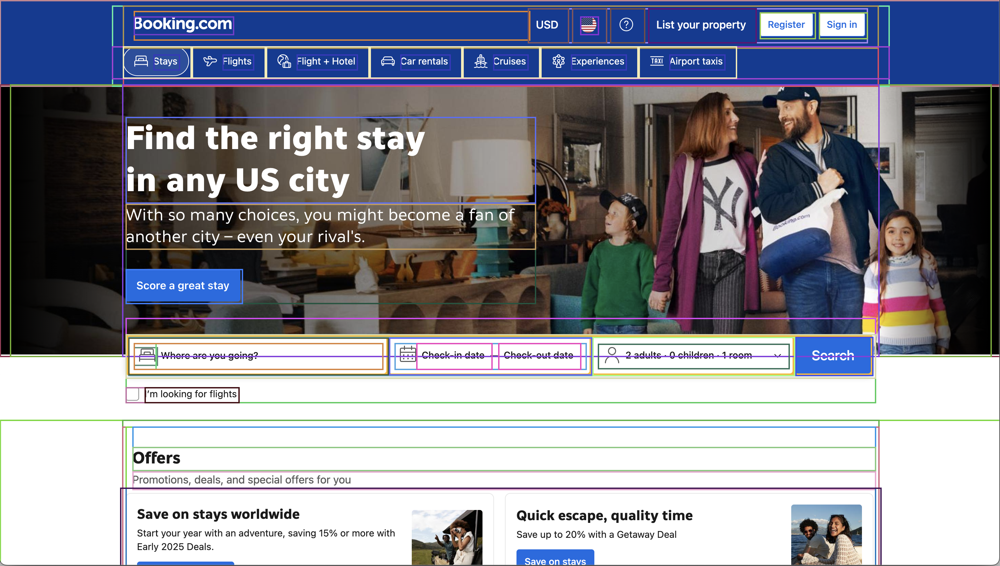

# DOM Explorer Chrome Extension

A powerful Chrome extension for visualizing and exploring DOM elements on any webpage. Highlight elements, export DOM structures, and pinpoint specific elements for web development, debugging, and educational purposes.



## Features

- 🎨 **Visual DOM Highlighting**: Draw colored bounding boxes around all visible DOM elements on a page
- 🎯 **Element Selection**: Highlight specific elements using their unique ID
- 📊 **DOM Tree Export**: Download a comprehensive JSON representation of the webpage structure
- 🔍 **Persistent Element IDs**: Elements can be identified even after page reloads
- 🖌️ **Consistent Coloring**: Similar elements (same tag and class) are highlighted with the same color
- ⚡ **Performance Optimized**: Designed to work efficiently even on complex webpages

## Installation

### From Source (Developer Mode)

1. Clone this repository or download the ZIP file and extract it
2. Open Chrome and navigate to `chrome://extensions/`
3. Enable "Developer mode" in the top-right corner
4. Click "Load unpacked" and select the directory containing these files
5. The extension icon should now appear in your Chrome toolbar

### From Chrome Web Store

*Coming soon!*

## Usage

### Highlighting All Elements

1. Click the extension icon in your Chrome toolbar
2. Toggle the "Highlight All Elements" switch to ON
3. The webpage will now display colored bounding boxes around DOM elements
4. Toggle the switch to OFF to remove the highlighting

### Downloading DOM Structure

1. Click the extension icon in your Chrome toolbar
2. Click the "Download Website Tree" button
3. A JSON file will be downloaded containing the complete DOM structure
4. This file includes unique IDs and paths for all elements

### Highlighting Specific Elements

1. First, download the DOM structure using the "Download Website Tree" button
2. Open the downloaded JSON file and find the element of interest
3. Copy the element's `uniqueId` value
4. Click the extension icon again
5. Paste the ID into the "Highlight Specific Element" input field and click "Go"
6. The specific element will be highlighted in red and scrolled into view

## Technical Details

The extension uses several advanced techniques to provide reliable DOM visualization:

### Stable Element Identification

Elements are identified using a combination of:
- Tag name
- Element ID (if available)
- Class names
- Text content
- Element-specific attributes (href, src, etc.)
- DOM path with position information
- Hashed path for efficient comparison

This approach allows the extension to find elements even after page reloads or minor DOM changes.

### Performance Optimization

- Debounced event handlers to prevent excessive redraws
- Selective element highlighting (limited to important elements)
- Display filtering to skip invisible elements
- Optimized mutation observation for DOM changes
- Automatic cleanup of resources

### DOM Tree Export Format

The exported JSON includes:
```json
{
  "title": "Page Title",
  "url": "https://example.com",
  "timestamp": "2023-03-31T06:12:40.126Z",
  "tree": {
    "uniqueId": "html_path_a1b2c3",
    "tag": "html",
    "id": null,
    "classes": [],
    "path": "html",
    "children": [
      {
        "uniqueId": "body_path_d4e5f6",
        "tag": "body",
        "id": null,
        "classes": [],
        "path": "html > body",
        "children": [...]
      }
    ]
  }
}
```

## Browser Compatibility

- Chrome: Fully supported
- Edge: Should work (Chromium-based)
- Firefox: Not currently supported

## Development

### Project Structure

- `manifest.json`: Extension configuration
- `popup.html`: UI for the extension popup
- `popup.js`: Logic for the popup interface
- `content.js`: Core functionality for DOM manipulation
- `background.js`: Background script for extension communication
- `icons/`: Extension icons in various sizes

### Building & Contributing

1. Clone the repository
2. Make your changes
3. Test the extension in Chrome using the "Load unpacked" option
4. Submit a pull request with your improvements

## License

MIT License - See the [LICENSE](LICENSE) file for details.

## Acknowledgments

- Inspired by the need for better DOM visualization tools for web development training
- Icon design created specifically for this project

---

Made with ❤️ for web developers and educators 